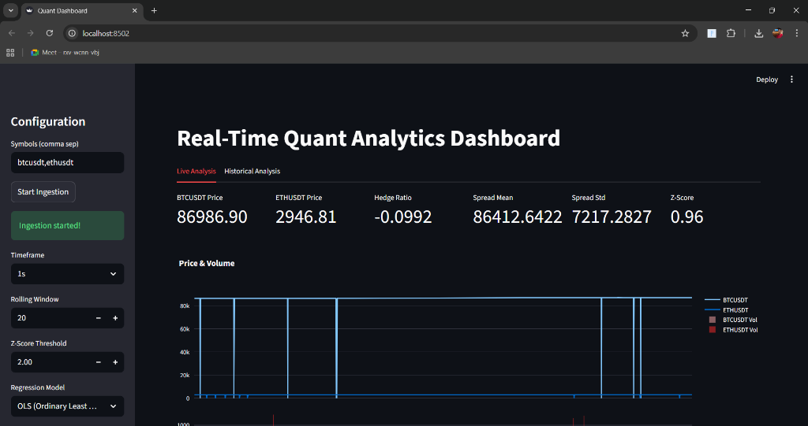
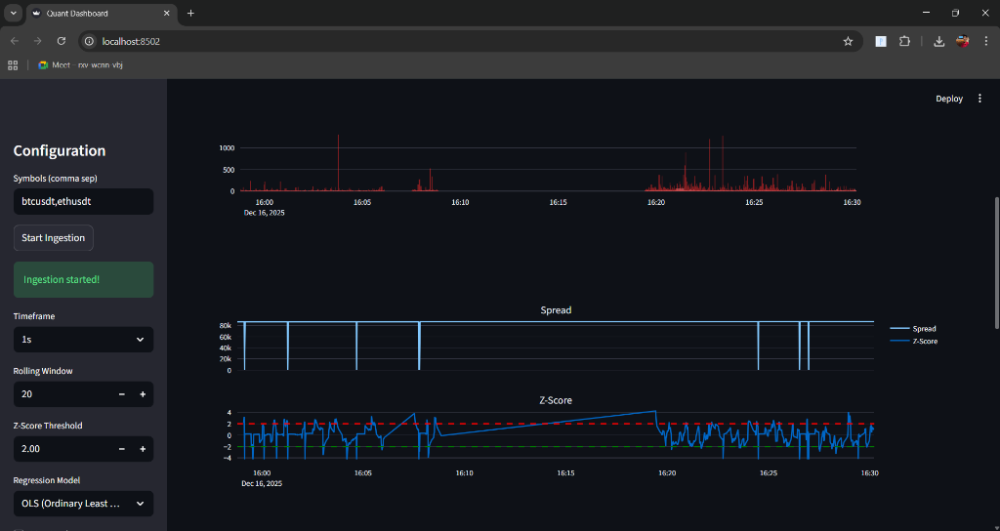
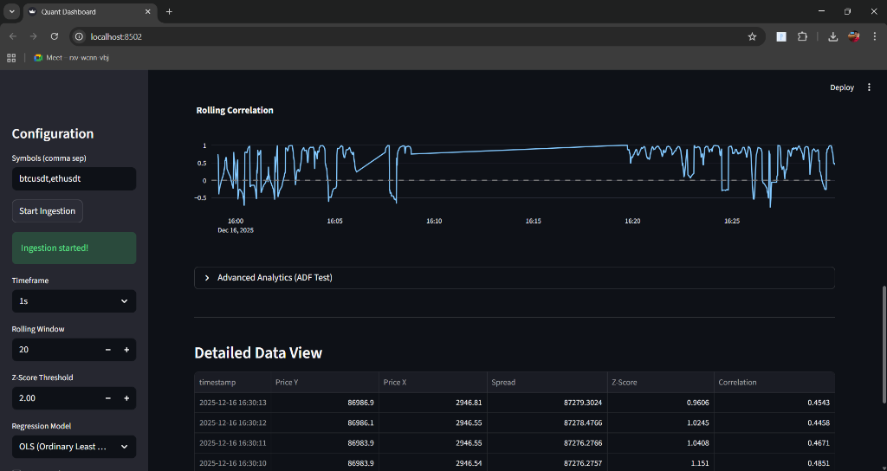
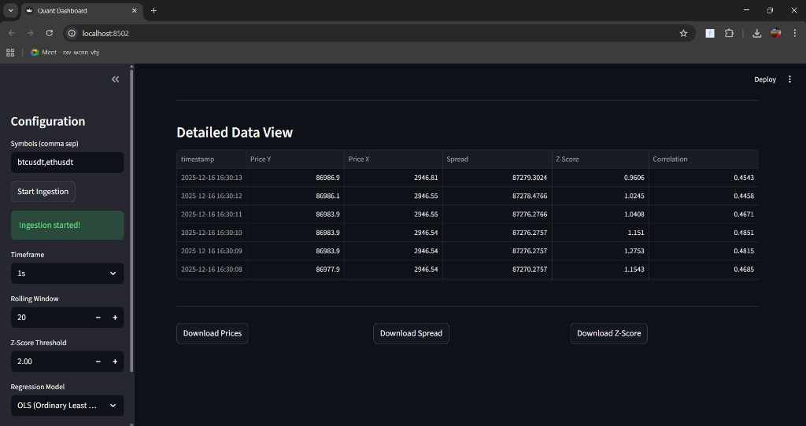
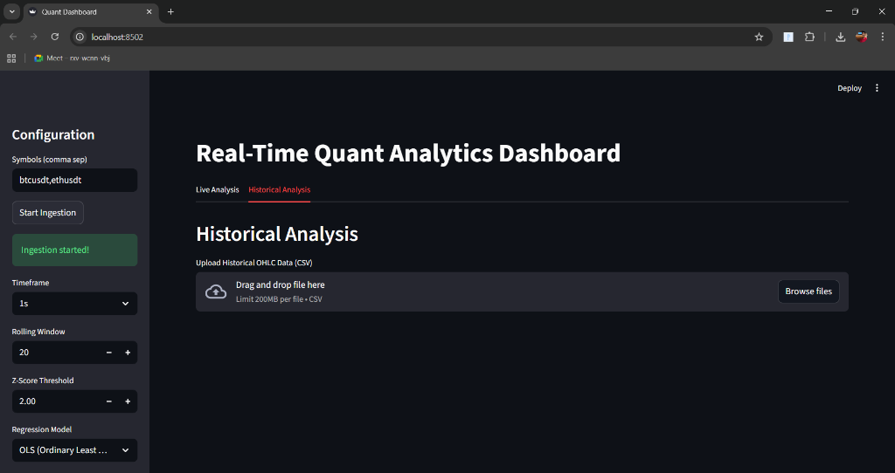

# Real-Time Quant Analytics Dashboard 📈

A sophisticated Pairs Trading Dashboard that ingests real-time cryptocurrency data from Binance, calculates statistical arbitrage opportunities using Cointegration/Z-Score analysis, and visualizes them in an interactive Streamlit interface.

## 📺 Demo Video
**[Click here to watch the project walkthrough video](YOUR_DRIVE_VIDEO_LINK_HERE)**

---

## 🖼️ Application Screenshots

### 1. Dashboard Overview
*Real-time monitoring of BTC/ETH prices, spread, and active trading signals.*


### 2. Spread & Z-Score Analysis
*Visualizing the mean-reverting spread and Z-Score deviations used for generating Buy/Sell signals.*


### 3. Advanced Analytics & Correlation
*Rolling correlation analysis and on-demand Augmented Dickey-Fuller (ADF) tests for stationarity.*


### 4. Detailed Data View
*Tabular view of all calculated metrics (Hedge Ratio, Spread, Z-Score) for transparency.*


### 5. Historical Analysis
*Feature to upload and analyze historical OHLC data from CSV files.*


---

## 🚀 Features
- **Real-Time Ingestion**: Connects to `wss://fstream.binance.com` to stream live tick data for multiple symbols.
- **Efficient Storage**: Uses SQLite with batch insertion to handle high-frequency data (~30k+ trades stored per session).
- **Quantitative Engine**:
    - **Hedge Ratio**: Dynamically calculated using OLS Regression.
    - **Spread**: `Spread = Price_Y - (Hedge_Ratio * Price_X)`
    - **Z-Score**: Rolling Z-Score to identify overbought/oversold conditions (Stat Arb).
    - **ADF Test**: Statistical test to confirm if the spread is stationary.
- **Interactive UI**: Built with Streamlit & Plotly. Includes Zoom/Pan charts, configurable timeframes (1s, 1m, 5m), and "Live Mode".

---

## 🛠️ Installation & Run

1. **Clone the Repository**
   ```bash
   git clone <repo_url>
   cd "Quant Developer Evaluation Assignment-Gemscap"
   ```

2. **Create Virtual Environment**
   ```bash
   python -m venv venv
   .\venv\Scripts\activate
   ```

3. **Install Dependencies**
   ```bash
   pip install -r requirements.txt
   ```

4. **Run the Application**
   ```bash
   python main.py
   ```
   *The application will launch automatically at `http://localhost:8502`.*

---

## 📐 Architecture
1.  **Ingestion Layer (`ingestion.py`)**: Async implementation using `websockets` to buffer and flush data to DB.
2.  **Storage Layer (`database.py`)**: SQLite database with indexed tables for fast querying.
3.  **Analytics Layer (`analytics.py`)**: `statsmodels` for regression, `pandas` for resampling (OHLCV) and window functions.
4.  **Frontend Layer (`app.py`)**: Streamlit application connecting all components.

## 📝 Methodology
The strategy relies on the principle of **Cointegration**. We assume that two assets (e.g., BTC and ETH) share a long-term equilibrium. When they diverge (Hedge Ratio adjusted spread moves away from 0), we expect them to revert.
*   **Buy Signal**: Z-Score < Threshold (e.g., -2.0)
*   **Sell Signal**: Z-Score > Threshold (e.g., +2.0)

---
## 💡 Design Decisions & Trade-offs

To meet the architectural requirements (40% of evaluation), the following design choices were made:

### 1. Storage: SQLite vs. Time-Series DB
- **Decision**: Used `SQLite` for local storage.
- **Trade-off**: `SQLite` is serverless and zero-configuration (ideal for assessment portability) but lacks the compression and partitioning of dedicated TSDBs like TimescaleDB or InfluxDB.
- **Mitigation**: Implemented **Batch Insertion** in `ingestion.py` to minimize I/O overhead and lock contention.

### 2. Concurrency: Threading vs. Multiprocessing
- **Decision**: Used `threading` for minimal resource overhead.
- **Reason**: Python's GIL is acceptable here because the workload is I/O-bound (network latency) rather than CPU-bound.
- **Extensibility**: The ingestion logic is decoupled in a separate class, allowing it to be easily moved to a separate microservice (`multiprocessing` or Docker container) if scaling is needed.

### 3. Reliability: Buffering & Logging
- **Redundancy**: The `BinanceIngestion` class uses an internal **buffer** (list). If the DB write fails briefly or lags, data is held in memory rather than dropped immediately.
- **Logging**: Comprehensive `logging` (to `app.log`) captures WebSocket disconnections and re-connection attempts, ensuring observability.

### 4. Modular Extensibility
- **Adding Pairs**: The system accepts a list of symbols (`['BTCUSDT', 'ETHUSDT']`). Adding a 3rd pair requires no code changes, just an update to the configuration input.
- **New Strategies**: The `Analytics` module is pure functional code. New strategies (e.g., Kalman Filter) can be added as new functions without breaking the ingestion pipeline.

---
*Developed for Quant Developer Assignment.*
